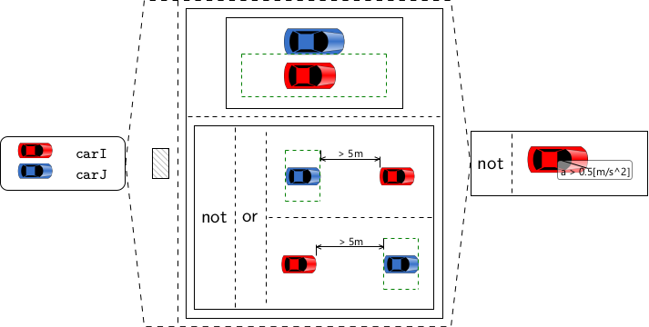
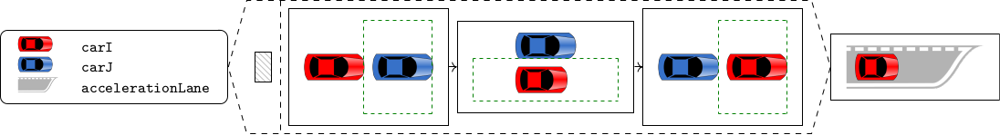
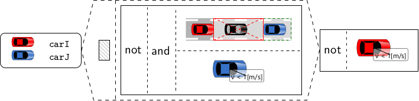
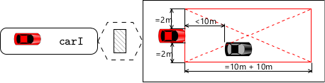
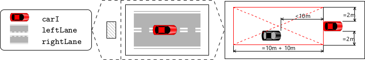
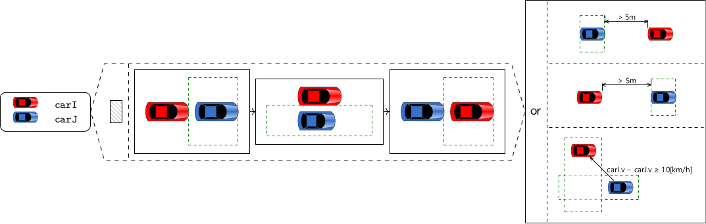
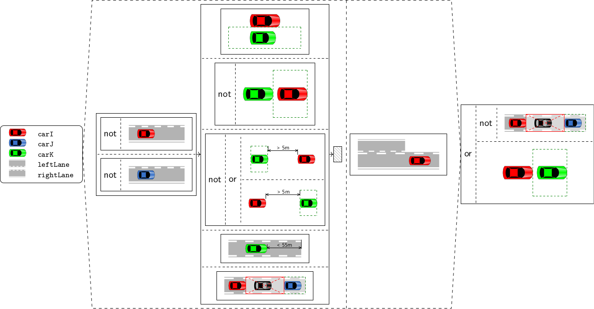

# fmics2023
Supplementary material for J. S. Becker: "Finding Real Conflicts in Scenario-based Requirements Specifications" submitted to FMICS 2023. 

(C) 2023 DLR e. V. 

This work is licensed under a [Creative Commons Attribution 4.0 International License](https://creativecommons.org/licenses/by/4.0/).

## Traffic Sequence Charts
The following traffic sequence charts have been used for the evaluation. 

### being overtaken

### below speed limit

### being overtaken

### keep in right-most lane

### no passing on the right side

### no stopping

### safe distance

### safe lane change

### speed advantage for overtaking

### zipper merge

## SMT scripts
The file [cases.md](cases.md) lists all the consistency cases that have not been skipped and links the SMTLib scripts and expected results. 
